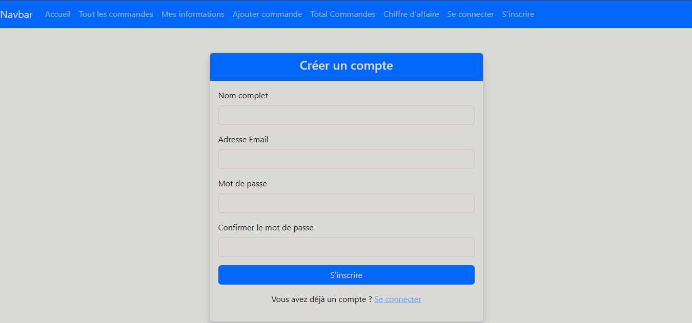
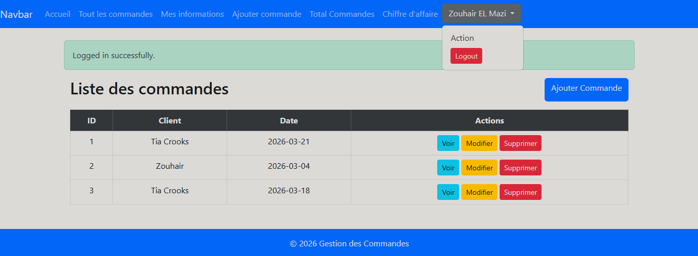
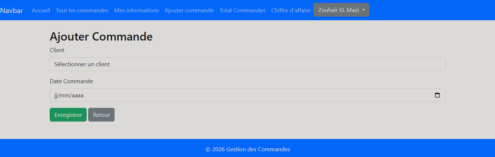
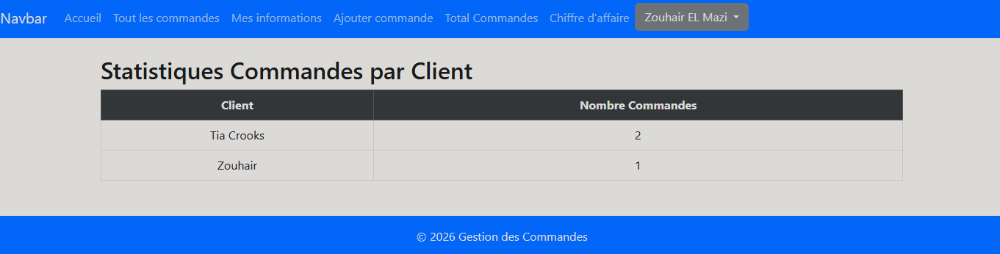
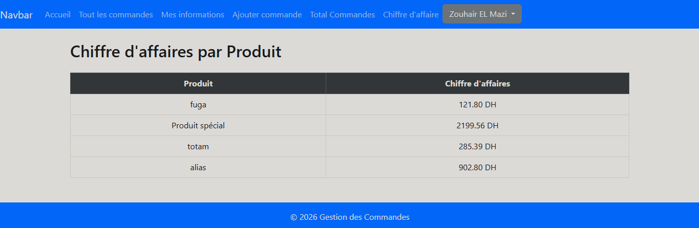
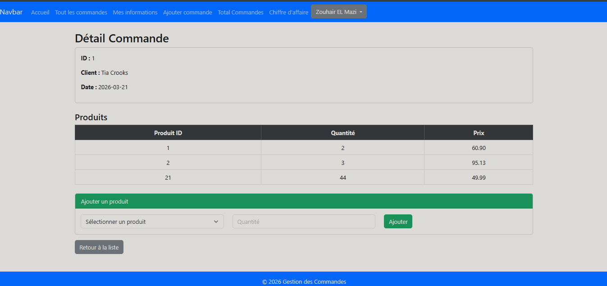
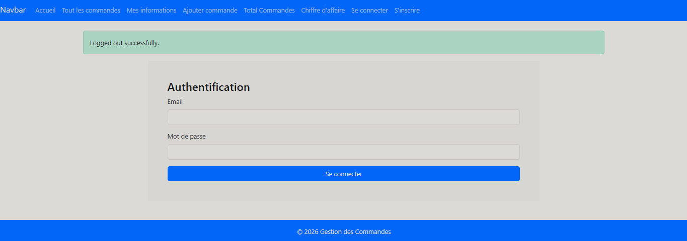

# G_Commandes

Petit projet Laravel (TP) pour gérer des commandes, produits et clients.

## Aperçu
- **Framework** : Laravel (PHP)
- **But** : CRUD pour les produits, clients et commandes, et pages/API de statistiques.

## Fonctionnalités principales
- Authentification : inscription, connexion, déconnexion.
- Gestion des clients : création / modification / suppression / consultation.
- Gestion des produits : création / modification / suppression / consultation.
- Gestion des commandes : création d'une commande liée à un client, ajout de produits (avec quantité) à une commande, modification et suppression.
- Détail de commande : affichage des produits, quantités et prix pour chaque commande.
- Statistiques : chiffre d'affaires par produit et nombre de commandes par client (pages protégées par authentification).

## Stack technique
- PHP 8+ et Laravel
- Eloquent ORM (modèles dans `app/Models`)
- Base de données : MySQL 
- Vues : Blade (`resources/views`)

## Routes principales
Les routes ci-dessous sont définies dans `routes/web.php` (extrait) :

| Méthode | Route | Description | Contrôleur / Notes |
|---|---|---|---|
| GET | / | Page d'accueil (vue `welcome`) | — |
| GET | /commandes | Lister les commandes | `CommandeController@index` (protégée par `auth`) |
| GET | /commandes/create | Formulaire d'ajout | `CommandeController@create` |
| POST | /commandes | Créer une commande | `CommandeController@store` |
| GET | /commandes/{id} | Voir le détail d'une commande | `CommandeController@show` |
| GET | /commandes/{id}/edit | Formulaire de modification | `CommandeController@edit` |
| PUT/PATCH | /commandes/{id} | Mettre à jour | `CommandeController@update` |
| DELETE | /commandes/{id} | Supprimer | `CommandeController@destroy` |
| POST | /commandes/{id}/add-product | Ajouter un produit à la commande | `CommandeController@addProduct` |
| GET | /RegisterForm | Formulaire d'inscription | — |
| POST | /Register | Enregistrer un utilisateur | — |
| GET | /LoginForm | Formulaire de connexion | — |
| POST | /Login | Action de connexion | — |
| POST | /Logout | Déconnexion | — |
| GET | /stats/clients | Statistiques — commandes par client | `StatsController@statsClients` (protégée par `auth`) |
| GET | /stats/produits | Chiffre d'affaires par produit | `StatsController@statsProduits` (protégée par `auth`) |

## Emplacements clés
- Modèles : `app/Models` (`Client`, `Produit`, `Commande`, `DetailCommande`, `User`)
- Contrôleurs : `app/Http/Controllers` (`CommandeController`, `LoginController`, `StatsController`, ...)
- Migrations : `database/migrations`
- Seeders : `database/seeders`
- Routes web : `routes/web.php`

## Installation & usage rapide
1. Copier `.env.example` en `.env` et configurer la DB.
2. Installer dépendances PHP :

```bash
composer install
```

3. Installer dépendances JS et compiler (optionnel) :

```bash
npm install
npm run build   # ou npm run dev
```

4. Générer la clé :

```bash
php artisan key:generate
```

5. Migrations et seeders :

```bash
php artisan migrate
php artisan db:seed
```

6. Lancer le serveur :

```bash
php artisan serve
```

📸 Captures d'écran - Description détaillée

1. Page d'inscription



Description :
Cette page représente le formulaire d'inscription des nouveaux utilisateurs. Elle contient :

Barre de navigation : Accueil, Toutes les commandes, Mes informations, Ajouter commande, Total Commandes, Chiffre d'affaire, ainsi que les liens "Se connecter" et "S'inscrire"

Formulaire d'inscription avec les champs :

Nom complet

Adresse Email

Mot de passe

Confirmer le mot de passe

Bouton "S'inscrire" pour valider l'inscription

Lien "Se connecter" pour les utilisateurs ayant déjà un compte

2. Liste des commandes



Description :
Cette affiche la liste de toutes les commandes enregistrées dans le système. On y trouve :

Message de confirmation : "Logged in successfully" indiquant que l'utilisateur est connecté

Tableau des commandes avec les colonnes :

ID de la commande

Nom du client

Date de la commande

Bouton "Ajouter Commande" pour créer une nouvelle commande

Actions disponibles pour chaque commande :

👁️ Voir (détails)

✏️ Modifier

🗑️ Supprimer

Pagination pour naviguer entre les pages (10 commandes par page)

3. Formulaire d'ajout de commande



Description :
Cette page permet de créer une nouvelle commande. Le formulaire contient :

Champ "Client" : Menu déroulant pour sélectionner le client parmi la liste existante

Champ "Date Commande" : Sélecteur de date au format jj/mm/aaaa

Bouton "Enregistrer" : Pour valider et créer la commande

Bouton "Retour" : Pour revenir à la liste des commandes sans enregistrer

4. Statistiques - Commandes par client



Description :
Cette page affiche les statistiques sur le nombre de commandes passées par chaque client. Le tableau présente :

Colonne "Client" : Nom du client

Colonne "Nombre Commandes" : Total des commandes pour ce client

Exemple de données :

Tia Crooks : 2 commandes

Zouhair : 1 commande

Cette vue permet d'identifier rapidement les clients les plus actifs

5. Statistiques - Chiffre d'affaires par produit



Description :
Cette page présente le chiffre d'affaires généré par chaque produit. Le tableau affiche :

Colonne "Produit" : Nom du produit

Colonne "Chiffre d'affaires" : Montant total des ventes en Dirhams (DH)

Exemple de données :

fuga : 121.80 DH

Produit spécial : 2199.56 DH

totam : 285.39 DH

alias : 902.80 DH

Cette vue permet d'identifier les produits les plus rentables

6. Détails d'une commande



Description :
Cette page affiche les informations détaillées d'une commande spécifique. On y trouve :

Informations générales :

ID de la commande : 1

Client : Tia Crooks

Date : 2026-03-21

Tableau des produits commandés avec :

Produit ID : Identifiant du produit

Quantité : Nombre d'unités commandées

Prix : Prix unitaire du produit

Zone "Ajouter un produit" :

Menu déroulant pour sélectionner un produit

Champ "Quantité" à saisir

Bouton "Ajouter" pour associer un produit supplémentaire à la commande

Bouton "Retour à la liste" pour revenir à la liste des commandes


7. Page de connexion



Description :
Cette page permet aux utilisateurs existants de s'authentifier pour accéder à l'application. Elle contient :

Barre de navigation :

Accueil

Toutes les commandes

Mes informations

Ajouter commande

Total Commandes

Chiffre d'affaire

Se connecter

S'inscrire

Message de confirmation : "Logged out successfully." indiquant que l'utilisateur a été déconnecté avec succès

Formulaire d'authentification avec les champs :

Email : Adresse email de l'utilisateur

Mot de passe : Champ masqué pour saisir le mot de passe

Bouton "Se connecter" : Pour valider l'authentification et accéder au tableau de bord

Pied de page : © 2026 Gestion des Commandes

## Auteurs

ZOUHAIR EL MAZI